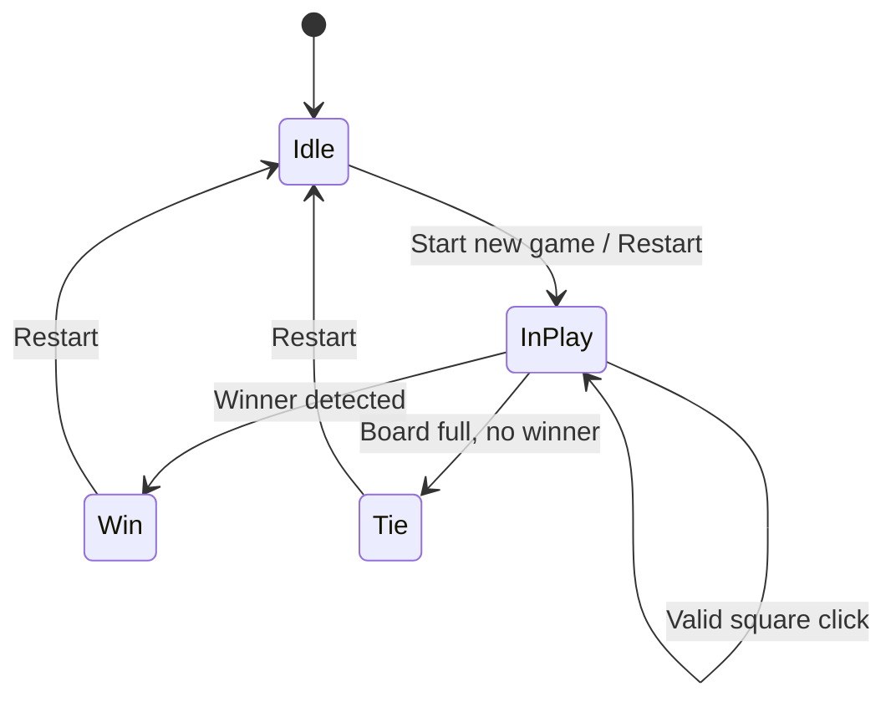

# Architecture Overview — Responsive Tic Tac Toe (React)

## System Overview
This is a single-container React frontend that renders a 3x3 Tic Tac Toe board and manages game state fully on the client. It runs locally on port 3000 in development and requires no backend services or environment variables for core functionality.

## UI/UX Design Guidelines (Ocean Professional theme)
The interface follows a modern, light aesthetic with the Ocean Professional palette:
- Primary: #2563EB
- Secondary: #F59E0B
- Error: #EF4444
- Background: #f9fafb
- Surface: #ffffff
- Text: #111827
- Gradient accents: from-blue-500/10 to-gray-50

Design principles include ample whitespace, subtle shadows, rounded corners, and smooth transitions on interactive elements. Squares present clear focus states, and labels/readouts communicate state changes.

## Component Architecture (React)
The UI is composed of a small set of focused components. The Game component owns the state and orchestrates rules and rendering. Board and Square are presentational with minimal logic.

```mermaid
graph TD
  A[App] --> B[Header/Title]
  A --> C[Game]
  C --> D[StatusBar]
  C --> E[Board]
  E --> E1[Square 0-2]
  E --> E2[Square 3-5]
  E --> E3[Square 6-8]
  C --> F[Controls (Restart)]
```

- App: Shell layout; composes Header and Game.
- Game: Owns game state; validates moves; derives winner/tie; passes handlers to Board and data to StatusBar/Controls.
- Board: Renders a 3x3 grid; forwards clicks to Game through provided callbacks.
- Square: Stateless, accessible button for a single cell.
- StatusBar: Displays current player or outcome (winner/tie).
- Controls: Provides Restart to reset the game.

## State Management (per-component or simple global state)
State is localized to the Game component via React hooks:
- board: string[9] where values are "X" | "O" | null
- isXNext: boolean indicating the current player
- winner: "X" | "O" | null (derived from board)
- isTie: boolean (derived when board is full and no winner)

State updates are immutable. Squares call a handler from Game; invalid actions (occupied cell or post-game) are ignored.

## Game Logic (turns, win/tie detection)
- On valid click, mark the cell with the current player, then toggle isXNext.
- Win detection checks eight lines (three rows, three columns, two diagonals).
- Tie detection occurs when all cells are non-null with no winner.
- Restart resets board and isXNext.

Winning line indices:
- Rows: [0,1,2], [3,4,5], [6,7,8]
- Columns: [0,3,6], [1,4,7], [2,5,8]
- Diagonals: [0,4,8], [2,4,6]

## Routing (if any)
None. The app uses a single view. If future enhancements add multi-view features (e.g., settings, history), routing can be introduced later.

## Dependencies and Libraries
- React (core)
- Styling can be implemented with CSS Modules or a utility framework (e.g., Tailwind) depending on project setup. No external services required.

## Build and Preview
Typical scripts:
- npm install — install dependencies
- npm run dev — start the local dev server at http://localhost:3000
- npm run build — build for production
- npm run preview — preview the production build

Tooling may be Vite or CRA-style depending on the actual project setup.

## Testing Strategy (unit tests ideas)
- Unit tests for game logic (calculateWinner, isTie) in a separate game/logic module.
- Component tests for Board/Square interactions to ensure clicks mutate state correctly and disallow invalid moves.
- Snapshot tests for key UI states: in-progress, win, tie.

Examples:
- calculateWinner returns "X" for a completed row [0,1,2] as X.
- Clicking an occupied square does not change the board.
- Restart clears the board and resets turn to X.

## Future Enhancements
- Move history and time travel
- Scoreboard across rounds
- Highlight the winning line
- Single-player vs Computer (minimax)
- Theming switch (dark mode, theme switcher)
- Routing for settings or history views


