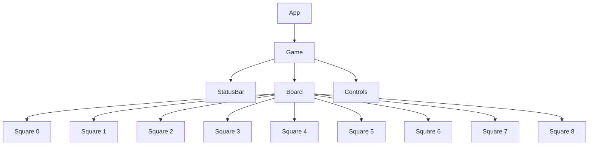
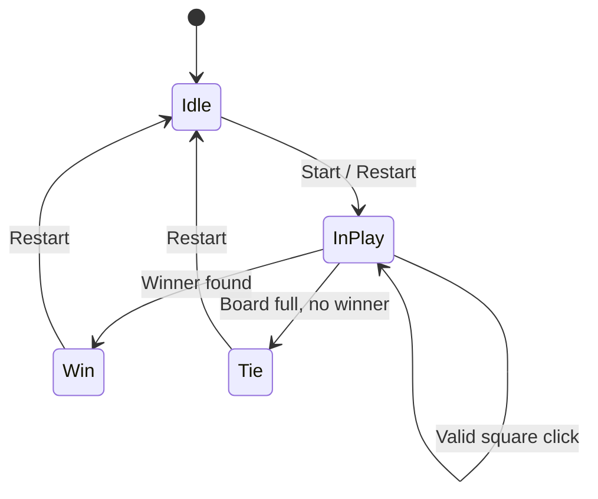

# Tic Tac Toe React Frontend — Architecture

## High-Level Overview
This project is a single-container React frontend that renders an interactive Tic Tac Toe game in the browser. It does not depend on any backend services. All game logic and state management reside in the client. The UI is designed with the Ocean Professional theme, featuring a centered layout, clean surfaces, subtle shadows, rounded corners, and smooth transitions.

- Platform: Web UI served via HTTP(S)
- Framework: React
- Container: tic_tac_toe_frontend
- Environment Variables: None required

## Component Architecture
The application is composed of small, focused React components. A typical structure is:

- App: Root component that sets up the page layout and theme context (if applicable). It composes the Game feature area and optional header.
- Game: Owns the game state and orchestrates gameplay events. It computes derived state (winner/tie) and passes props to child components.
- StatusBar: Displays current player, or the outcome (win/tie).
- Board: Visual 3x3 grid responsible for rendering nine Square components. It forwards user interactions (clicks) to the Game component.
- Square: Stateless, button-like component representing a single cell on the board.
- Controls: Provides the Restart/New Game button.

A possible component tree:
- App
  - Header (optional title and theme)
  - Game
    - StatusBar
    - Board
      - Square × 9
    - Controls

## Diagrams

### Component Map

### State Lifecycle

## State Management
The Game component maintains the following state using React hooks:
- board: string[9] with values "X" | "O" | null
- isXNext: boolean determining the next player
- winner: "X" | "O" | null (derived)
- isTie: boolean (derived)

Principles:
- Immutable updates: Clicking a Square triggers a handler in Game that creates a new board array rather than mutating the existing one.
- Guard conditions: Ignore clicks if the square is already filled or if the game has ended (winner or tie).
- Derived values recompute after each move to update StatusBar and Controls.

## Data Flow
- User clicks a Square.
- Board forwards the click index to Game.
- Game validates the move:
  - If no winner and the target square is empty, place the current player's mark.
  - Recompute winner using the winner/tie logic.
  - Toggle isXNext if the game continues.
- Game updates state, triggering a re-render of StatusBar, Board, and Controls.

Sequence (simplified):
1. Square.onClick(index)
2. Board.onSquareClick(index) → Game.handleMove(index)
3. Game:
   - If winner or board[index] not null, return early.
   - Copy board; set board[index] = isXNext ? "X" : "O".
   - Compute winner; if none, check for tie.
   - Update state: board, isXNext, winner, isTie.

## Game Logic
The game uses standard Tic Tac Toe rules:
- Winning lines (8 total): rows [0,1,2], [3,4,5], [6,7,8]; columns [0,3,6], [1,4,7], [2,5,8]; diagonals [0,4,8], [2,4,6].
- Winner detection: For each winning line, if board[a] is not null and board[a] === board[b] === board[c], return that mark as winner.
- Tie detection: If no winner and all squares are non-null, it is a tie.
- Restart: Resets board to all nulls and isXNext to true (X starts).

Example indices and wins:
- Indices:
  - 0 | 1 | 2
  - 3 | 4 | 5
  - 6 | 7 | 8
- Wins:
  - Rows: [0,1,2], [3,4,5], [6,7,8]
  - Columns: [0,3,6], [1,4,7], [2,5,8]
  - Diagonals: [0,4,8], [2,4,6]

## Responsiveness Approach
- Layout: Centered game board with a clear title/status and a reset button below.
- Grid: Implement the 3x3 board using CSS Grid or Flexbox.
- Square sizing:
  - Use CSS aspect-ratio: 1 / 1 where supported to keep squares responsive.
  - Provide a fallback with intrinsic ratio techniques if necessary.
- Breakpoints: Typography and spacing scale modestly across viewport sizes.
- Touch/Keyboard: Buttons have adequate hit areas; focus states and hover transitions are visible and consistent.

## Styling and Theme Usage
Apply the Ocean Professional theme:
- Primary: #2563EB
- Secondary/Success: #F59E0B
- Error: #EF4444
- Background: #f9fafb
- Surface: #ffffff
- Text: #111827
- Gradient accents: from-blue-500/10 to-gray-50

Guidelines:
- Prefer clean surfaces with subtle shadows and rounded corners for containers and Squares.
- Use primary and secondary colors for emphasis and interactive highlights.
- Ensure sufficient contrast for text and focus outlines.
- Smooth transitions on hover/focus to reinforce interactivity.

## Suggested Project Structure
- src/
  - components/
    - Board.jsx
    - Square.jsx
    - StatusBar.jsx
    - Controls.jsx
  - game/
    - logic.js (winner/tie helpers)
    - constants.js
  - styles/
    - theme.css (CSS variables from style guide)
    - globals.css
  - App.jsx
  - main.jsx
- public/
- README.md

Rationale:
- Keep game logic in a game/ module for testability and separation of concerns.
- Keep presentation and interaction in components/.

## Build and Deployment Notes
- Local development:
  - npm install
  - npm run dev (preview typically on http://localhost:3000)
- Production build:
  - npm run build
  - npm run preview (optional for verification)
- Deployment:
  - Serve the production build as static files from any static hosting provider or containerized web server.
- Environment variables:
  - None required for the current scope. If introduced later, provide .env.example and documentation.

## Accessibility
- Squares implemented as buttons or elements with role="button", keyboard focusable and activatable with Enter/Space.
- ARIA labels to announce square number and current value (e.g., “Square 1, value X”).
- Ensure color contrast meets WCAG AA where feasible.
- Visual focus indicators for keyboard navigation.

## Testing Considerations
- Unit tests for game/logic.js (winner detection across all winning lines; tie conditions).
- Component tests:
  - Clicking an empty square places the correct mark.
  - Prevent moves on filled squares.
  - Prevent moves after win/tie.
  - Restart resets state.
- Snapshot or visual tests for StatusBar across states (in-progress, X wins, O wins, tie).

## Future Enhancements
- Move history and time travel for undo/redo.
- Persistent scoreboard across rounds.
- Highlight the winning line with animated styles.
- Single-player vs Computer (minimax AI).
- Theming switch (light/dark) or theme editor.

## References
- Responsive Tic Tac Toe README in this repository’s frontend container describing the Ocean Professional theme, architecture overview, and features.

